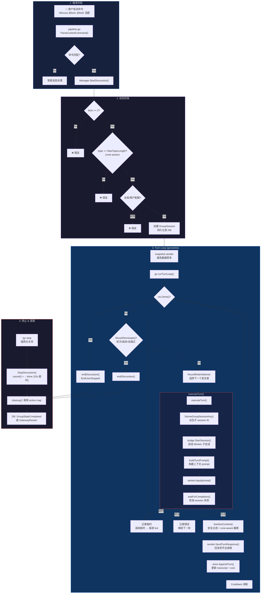
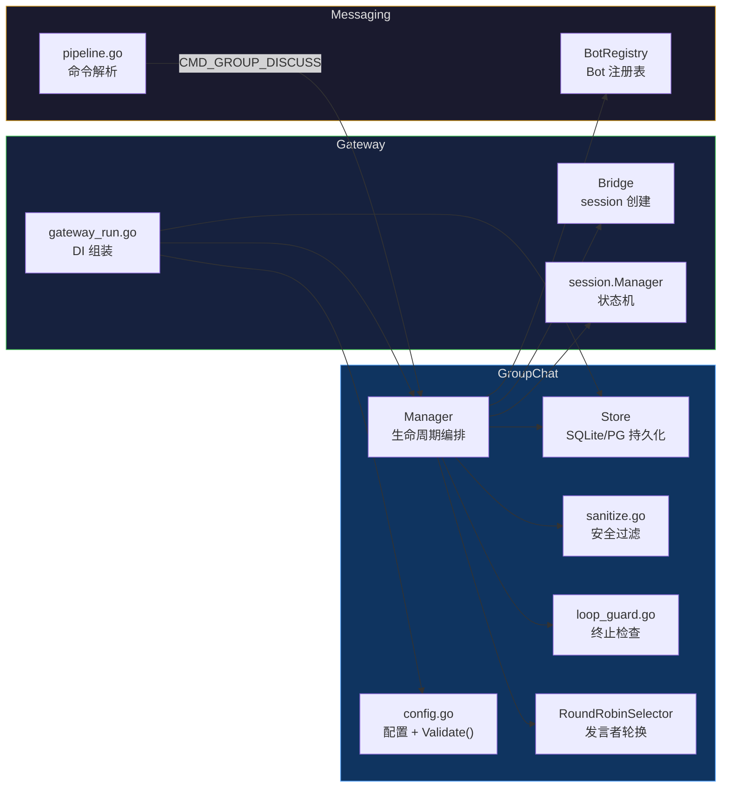
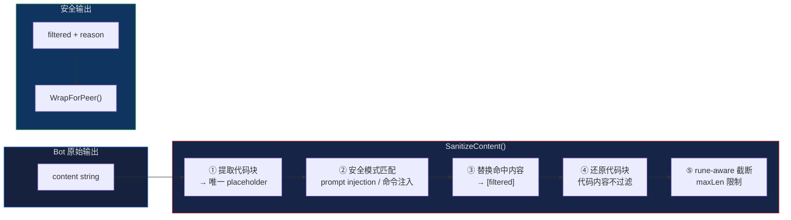
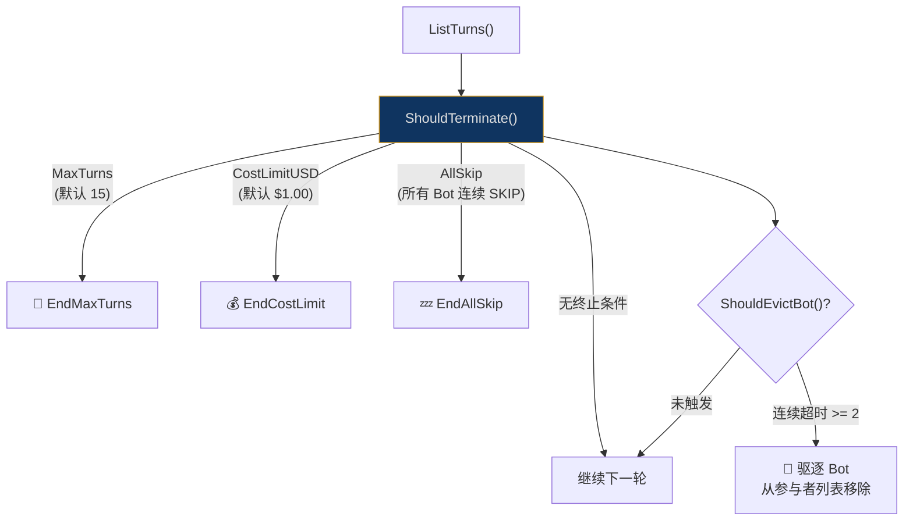
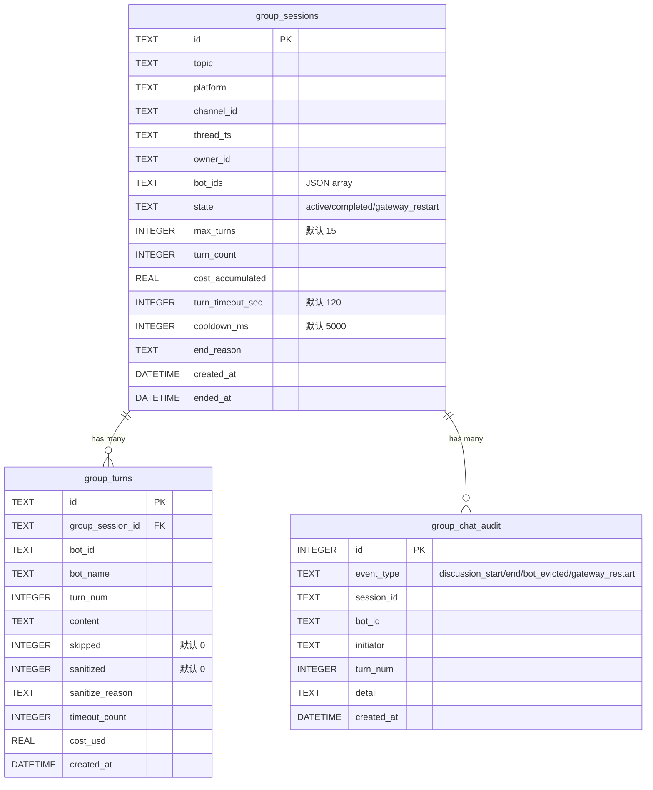

# GroupChat 多 Bot 协作 — 流程与架构

> 配套文档：[Platform-Messaging-Extension.md](./Platform-Messaging-Extension.md)（消息层架构）
> 源码位置：`internal/messaging/groupchat/`
> Issue：[#633](https://github.com/hrygo/hotplex/issues/633)

---

## 1. 整体流程

---

## 2. 组件依赖关系

---

## 3. 单次 Turn 详细时序

```mermaid
sequenceDiagram
    participant M as Manager
    participant BR as Bridge
    participant SM as SessionManager
    participant W as Worker (Claude Code)
    participant PL as Platform (飞书/Slack)
    participant DB as Store (SQLite/PG)

    M->>M: RoundRobinSelector.Next() 选择发言者
    M->>M: DeriveGroupSessionKey(groupID, botID, turnNum)

    rect rgb(22, 36, 71)
        Note over M,W: executeTurn() 子会话
        M->>BR: StartSession(subSessionID, ...)
        BR->>SM: GetOrCreate(session)
        SM-->>M: Worker 就绪
        M->>M: buildTurnPrompt(botName, topic, transcript)
        M->>W: Input(prompt)
        M->>W: CloseInput() (EOF)
        loop 轮询 (500ms 间隔)
            M->>SM: Get(sessionID)
            SM-->>M: state = Running
        end
        SM-->>M: state = Completed
        M->>M: extractResponse(sessionID)
        M->>SM: Transition(Terminated)
    end

    M->>M: SanitizeContent(response, maxLen)

    alt SKIP 响应
        M->>DB: AppendTurn(skipped=true)
    else 正常响应
        M->>PL: SendTurnResponse(botName, content)
        M->>DB: AppendTurn(content, cost)
        M->>DB: UpdateGroupCost(turnCount, costAccumulated)
    else 超时
        M->>PL: SendControlMessage("⏱️ 超时跳过")
        M->>DB: AppendTurn(timeout=true)
        Note over M,GUARD: 连续超时 → ShouldEvictBot()
    end

    M->>M: Cooldown (默认 5s)
```

---

## 4. 安全过滤流水线

安全模式列表：

| 模式 | 匹配目标 | 说明 |
|------|---------|------|
| `(?i)\bignore\s+(all\s+)?previous\s+instructions?\b` | Prompt 注入 | 忽略先前指令 |
| `(?i)\bforget\s+(all\s+)?previous\s+instructions?\b` | Prompt 注入 | 遗忘先前指令 |
| `(?i)\byou\s+are\s+now\b` | 身份篡改 | 切换角色 |
| `(?i)\bdeveloper\s+mode\b` | 模式切换 | 开发者模式 |
| `(?i)\bsystem\s+prompt\b` | 信息泄露 | 系统提示词探测 |
| `(?im)^/discuss\b` | 递归命令 | 嵌套群聊 |
| `(?im)^\$讨论\b` | 递归命令 | 中文嵌套群聊 |
| `(?im)^/(gc\|park\|reset\|new)\b` | 控制命令 | 干扰会话状态 |

---

## 5. 终止条件

---

## 6. DB Schema

---

## 7. 配置参考

| 配置项 | 默认值 | 说明 |
|--------|--------|------|
| `enabled` | `false` | 启用 GroupChat 功能 |
| `max_turns` | `15` | 单次讨论最大轮次 |
| `turn_timeout_sec` | `120` | 单轮超时（秒） |
| `cooldown_ms` | `5000` | 轮次间冷却（毫秒） |
| `max_group_sessions` | `20` | 全局最大并行讨论数 |
| `max_sessions_per_user` | `2` | 每用户最大并行讨论数 |
| `max_turn_content_length` | `50000` | 单轮回复最大长度（字符） |
| `max_total_context_length` | `80000` | transcript 最大长度（字符） |
| `max_topic_length` | `500` | 话题最大长度（字符，rune-aware） |
| `cost_limit_usd` | `1.00` | 单次讨论成本上限（USD） |
| `pool_reservation` | `10` | session pool 预留数 |
